```mermaid
graph LR
    A[Idea 💡] --> B[Plan 📋]
    B --> C[Code 💻]
    C --> D[Test 🧪]
    D --> E{Pass? ❓}
    E -->|Yes ✅| F[Deploy 🚀]
    E -->|No ❌| G[Debug 🐛]
    G --> C
    F --> H[Monitor 📊]
```

# OkiDoki Features Showcase

This comprehensive showcase demonstrates all the powerful features available in OkiDoki, with source code examples and their rendered output.

[[toc]]

## Introduction :wave:

OkiDoki is a modern documentation site builder that transforms your markdown files into beautiful, interactive documentation websites. This page showcases every feature with live examples! :sparkles:

## Markdown Features :book:

### Basic Markdown Elements

**Source Code:**
````markdown
# Heading 1
## Heading 2
### Heading 3

**Bold text** and *italic text*

- Unordered list item 1
- Unordered list item 2
  - Nested item

1. Ordered list item 1
2. Ordered list item 2

[Link to example](https://example.com)

`Inline code`

> Blockquote text
````

**Rendered Output:**

# Heading 1
## Heading 2
### Heading 3

**Bold text** and *italic text*

- Unordered list item 1
- Unordered list item 2
  - Nested item

1. Ordered list item 1
2. Ordered list item 2

[Link to example](https://example.com)

`Inline code`

> Blockquote text

### Code Blocks with Syntax Highlighting

**Source Code:**
````markdown
```javascript
function greet(name) {
    console.log(`Hello, ${name}!`);
    return `Welcome, ${name}`;
}

greet("World");
```
````

**Rendered Output:**

```javascript
function greet(name) {
    console.log(`Hello, ${name}!`);
    return `Welcome, ${name}`;
}

greet("World");
```

### Tables

**Source Code:**
````markdown
| Feature | Status | Description |
|---------|--------|-------------|
| Markdown | ✅ | Full markdown support |
| Plugins | ✅ | Extensible plugin system |
| Themes | ✅ | Light/dark themes |
| Search | ✅ | Built-in search |
````

**Rendered Output:**

| Feature | Status | Description |
|---------|--------|-------------|
| Markdown | ✅ | Full markdown support |
| Plugins | ✅ | Extensible plugin system |
| Themes | ✅ | Light/dark themes |
| Search | ✅ | Built-in search |

## Plugin Features :puzzle_piece:

### Table of Contents Plugin

**Source Code:**
````markdown
[[toc]]

## Section 1
Content here...

## Section 2
More content...
````

**Rendered Output:**

The table of contents appears automatically at the top of this page! 📑 It generates hierarchical navigation based on your headings.

### MathJax3 Plugin :abacus:

**Source Code:**
````markdown
Inline math: $E = mc^2$

Block math:
$$
\int_{-\infty}^{\infty} e^{-x^2} dx = \sqrt{\pi}
$$
````

**Rendered Output:**

Inline math: $E = mc^2$

Block math:
$$
\int_{-\infty}^{\infty} e^{-x^2} dx = \sqrt{\pi}
$$

### Mermaid Diagrams :chart_with_upwards_trend:

**Source Code:**
````markdown

````

**Rendered Output:**


### Emoji Plugin :art:

**Source Code:**
````markdown
Welcome! :wave: This is amazing! :sparkles: :rocket: :star:
````

**Rendered Output:**

Welcome! 👋 This is amazing! ✨ 🚀 ⭐

## Handlebars Features :gear:

### Variables and Context

**Source Code:**
````markdown
Site Title: \{{site.title}}
Base URL: \{{site.baseUrl}}
Version: \{{version}}
````

**Rendered Output:**

Site Title: {{site.title}}

Base URL: {{site.baseUrl}}

Version: {{version}}

### Conditional Logic

**Source Code:**
````markdown
{{#if site.title}}
The title is: {{site.title}}
{{else}}
No title provided
{{/if}}
````

**Rendered Output:**

{{#if site.title}}
The title is: {{site.title}}
{{else}}
No title provided
{{/if}}

### Loops and Iteration

**Source Code:**
````markdown
{{#each keywords_array}}
- {{this}}
{{/each}}
````

**Rendered Output:**

*Note: The keywords_array is automatically generated from the frontmatter keywords. Here's what it would look like:*

{{#each keywords_array}}
- {{this}}
{{/each}}

## Admonitions :warning:

### Basic Admonitions

**Source Code:**
````markdown
::: tip
This is a helpful tip!
:::

::: warning
This is a warning message.
:::

::: danger
This is a danger alert!
:::

::: info
This is an informational note.
:::
````

**Rendered Output:**

::: tip
This is a helpful tip!
:::

::: warning
This is a warning message.
:::

::: danger
This is a danger alert!
:::

::: info
This is an informational note.
:::

### Custom Admonitions

**Source Code:**
````markdown
::: success
Operation completed successfully! :white_check_mark:
:::

::: note
Remember to save your work frequently.
:::
````

**Rendered Output:**

::: success
Operation completed successfully! ✅
:::

::: note
Remember to save your work frequently.
:::

## Tabs Feature :bookmark_tabs:

### Basic Tabs

**Source Code:**
````markdown
{{#tabs}}
{{#tab title="JavaScript"}}
```javascript
function hello() {
    console.log("Hello from JS!");
}
```
{{/tab}}
{{#tab title="Python"}}
```python
def hello():
    print("Hello from Python!")
```
{{/tab}}
{{#tab title="Go"}}
```go
func hello() {
    fmt.Println("Hello from Go!")
}
```
{{/tab}}
{{/tabs}}
````

**Rendered Output:**

{{#tabs}}
{{#tab title="JavaScript"}}
```javascript
function hello() {
    console.log("Hello from JS!");
}
```
{{/tab}}
{{#tab title="Python"}}
```python
def hello():
    print("Hello from Python!")
```
{{/tab}}
{{#tab title="Go"}}
```go
func hello() {
    fmt.Println("Hello from Go!")
}
```
{{/tab}}
{{/tabs}}

### Tabs with Mixed Content

**Source Code:**
````markdown
{{#tabs}}
{{#tab title="Installation"}}
Install OkiDoki via npm:

```bash
npm install -g okidoki
```
{{/tab}}
{{#tab title="Usage"}}
Generate documentation:

```bash
okidoki generate
```
{{/tab}}
{{#tab title="Configuration"}}
Create `okidoki.yaml`:

```yaml
settings:
  site:
    title: "My Docs"
```
{{/tab}}
{{/tabs}}
````

**Rendered Output:**

{{#tabs}}
{{#tab title="Installation"}}
Install OkiDoki via npm:

```bash
npm install -g okidoki
```
{{/tab}}
{{#tab title="Usage"}}
Generate documentation:

```bash
okidoki generate
```
{{/tab}}
{{#tab title="Configuration"}}
Create `okidoki.yaml`:

```yaml
settings:
  site:
    title: "My Docs"
```
{{/tab}}
{{/tabs}}

## Image Features :frame_with_picture:

### Basic Images

**Source Code:**
````markdown

````

**Rendered Output:**


### Images with Size Control

**Source Code:**
````markdown


````

**Rendered Output:**


## Combined Features :mag:

### Complex Example with Multiple Features

**Source Code:**
````markdown
## Project Status :chart_with_upwards_trend:

Our development workflow:


::: success
Success rate: **95%** :tada:
:::

The success probability can be calculated as:

$$P(success) = \frac{\text{successful deployments}}{\text{total attempts}} \times 100\%$$

{{#tabs}}
{{#tab title="Metrics"}}
- Deployments: 100
- Successes: 95
- Failures: 5
{{/tab}}
{{#tab title="Formula"}}
$$P = \frac{95}{100} \times 100\% = 95\%$$
{{/tab}}
{{/tabs}}
````

**Rendered Output:**

## Project Status 📈

Our development workflow:



::: success
Success rate: **95%** 🎉
:::

The success probability can be calculated as:

$$P(success) = \frac{\text{successful deployments}}{\text{total attempts}} \times 100\%$$

{{#tabs}}
{{#tab title="Metrics"}}
- Deployments: 100
- Successes: 95
- Failures: 5
{{/tab}}
{{#tab title="Formula"}}
$$P = \frac{95}{100} \times 100\% = 95\%$$
{{/tab}}
{{/tabs}}

## Theme Features :art:

### Light and Dark Themes

OkiDoki automatically supports both light and dark themes with a theme switcher in the navigation bar. All features adapt seamlessly to the selected theme:

- **Mathematical expressions** maintain readability
- **Mermaid diagrams** use theme-appropriate colors
- **Code blocks** have proper syntax highlighting
- **Admonitions** have theme-aware styling

## Search Features :mag:

OkiDoki includes built-in search functionality powered by Lunr.js:

- **Full-text search** across all documentation
- **Instant results** as you type
- **Highlighted matches** in search results
- **Keyboard navigation** support

## Responsive Design :iphone:

All features work seamlessly across devices:

- **Mobile-first** design approach
- **Responsive tables** and diagrams
- **Touch-friendly** navigation
- **Optimized performance** on all screen sizes

## Conclusion :checkered_flag:

OkiDoki provides a comprehensive set of features for creating beautiful, interactive documentation:

- ✅ **Rich Markdown** support with syntax highlighting
- ✅ **Powerful Plugins** for math, diagrams, and emojis
- ✅ **Handlebars Templates** for dynamic content
- ✅ **Admonitions** for important information
- ✅ **Tabs** for organized content
- ✅ **Theme Support** with light/dark modes
- ✅ **Search** functionality
- ✅ **Responsive Design** for all devices

Start building your documentation today! :rocket: :sparkles: :star:

---

*Happy documenting with OkiDoki!* :wave: :heart:
