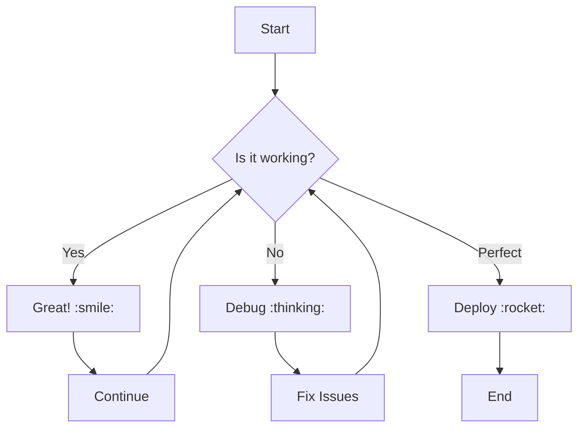
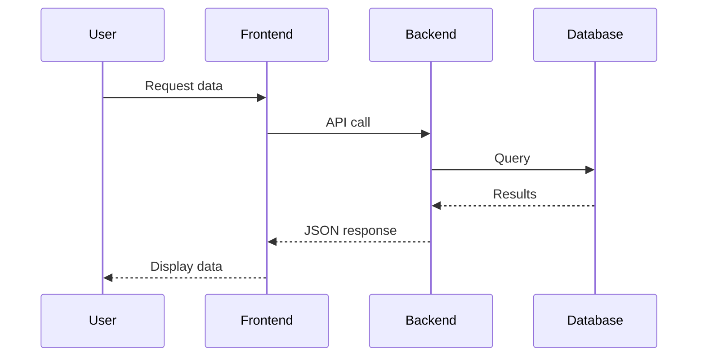
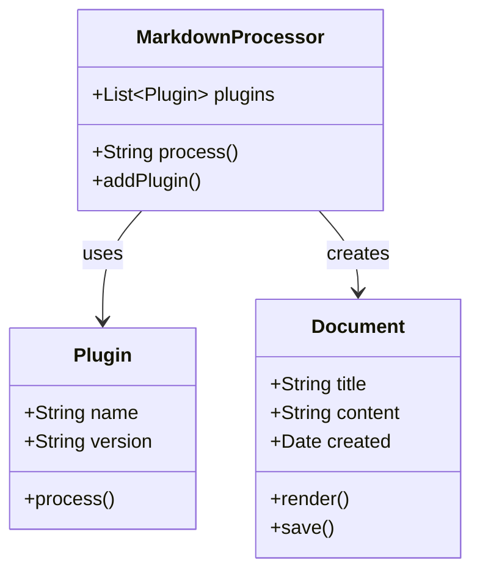
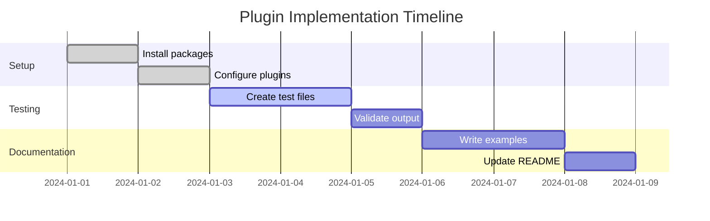
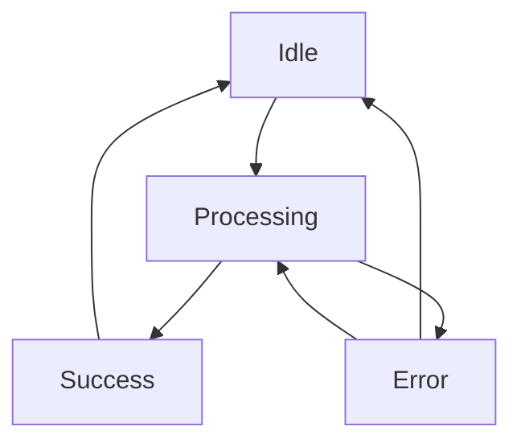
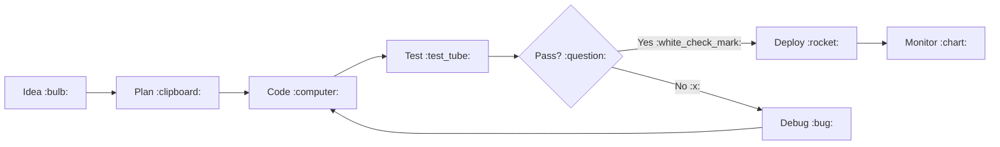

# Markdown Plugin Features Showcase

This page demonstrates all the markdown plugins implemented in Okidoki: Table of Contents, MathJax3, Mermaid diagrams, and Emoji support.

[[toc]]

## Introduction :wave:

Welcome to the comprehensive showcase of markdown plugin features! This page demonstrates how Okidoki enhances your documentation with powerful markdown extensions. :sparkles:

## Table of Contents Plugin :bookmark_tabs:

The table of contents plugin automatically generates a hierarchical navigation based on your document headings. Simply add `[[toc]]` anywhere in your document to create a table of contents.

### Features
- Automatic heading detection
- Hierarchical structure
- Clickable anchor links
- Customizable styling

## Mathematical Expressions :abacus:

MathJax3 plugin enables beautiful mathematical notation using LaTeX syntax.

### Inline Math

Here's Einstein's famous equation: $E = mc^2$

The quadratic formula: $x = \frac{-b \pm \sqrt{b^2 - 4ac}}{2a}$

### Block Math

The Gaussian integral:

$$
\int_{-\infty}^{\infty} e^{-x^2} dx = \sqrt{\pi}
$$

Maxwell's equations:

$$
\begin{align}
\nabla \times \vec{\mathbf{B}} -\, \frac1c\, \frac{\partial\vec{\mathbf{E}}}{\partial t} &= \frac{4\pi}{c}\vec{\mathbf{j}} \\
\nabla \cdot \vec{\mathbf{E}} &= 4 \pi \rho \\
\nabla \times \vec{\mathbf{E}}\, +\, \frac1c\, \frac{\partial\vec{\mathbf{B}}}{\partial t} &= \vec{\mathbf{0}} \\
\nabla \cdot \vec{\mathbf{B}} &= 0
\end{align}
$$

### Matrix Operations

Matrix multiplication:

$$
\begin{pmatrix}
a & b \\
c & d
\end{pmatrix}
\begin{pmatrix}
e & f \\
g & h
\end{pmatrix}
=
\begin{pmatrix}
ae+bg & af+bh \\
ce+dg & cf+dh
\end{pmatrix}
$$

## Mermaid Diagrams :chart_with_upwards_trend:

Mermaid plugin creates beautiful, interactive diagrams from simple text syntax.

### Flowchart

### Sequence Diagram

### Class Diagram

### Gantt Chart

### State Diagram

## Emoji Support :art:

The emoji plugin converts shortcode syntax to beautiful Unicode emojis.

### Basic Emojis

Common expressions: :smile: :heart: :thumbsup: :fire: :rocket: :star: :tada: :sparkles:

### Technical Emojis

Development workflow: :computer: :keyboard: :mouse: :floppy_disk: :camera: :telephone: :bulb: :gear:

### Nature & Weather

Environmental: :sunny: :cloud: :rainbow: :snowflake: :zap: :earth_americas: :moon: :star2:

### Food & Activities

Life & leisure: :coffee: :cake: :pizza: :beer: :soccer: :basketball: :tennis: :swimming:

### Status Indicators

Feedback: :white_check_mark: :x: :warning: :information_source: :exclamation: :question: :heavy_check_mark: :negative_squared_cross_mark:

## Combined Features :mag:

You can combine all these features in a single document! Here's an example:

### Project Status Dashboard :chart_with_upwards_trend:

Our development process follows this workflow:

The success rate can be calculated using:

$$P(success) = \frac{\text{successful deployments}}{\text{total attempts}} \times 100\%$$

Current metrics show: :chart_with_upwards_trend: **95%** success rate! :tada:

## Conclusion :checkered_flag:

This showcase demonstrates the powerful capabilities of Okidoki's markdown plugin ecosystem:

- **Table of Contents**: Automatic navigation :bookmark_tabs:
- **MathJax3**: Beautiful mathematical notation :abacus:
- **Mermaid**: Interactive diagrams :chart_with_upwards_trend:
- **Emoji**: Expressive visual elements :art:

All plugins work seamlessly together to create rich, engaging documentation! :sparkles: :rocket: :star:

---

*Happy documenting!* :wave: :heart:
